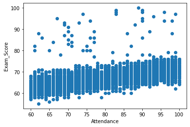
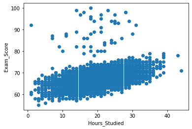
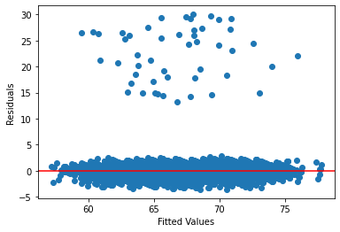
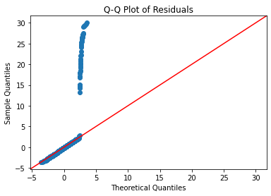
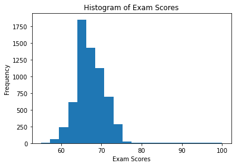
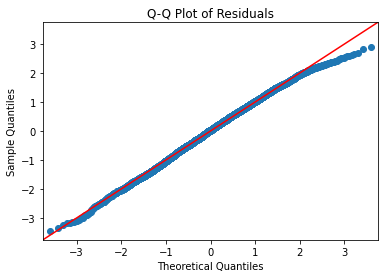
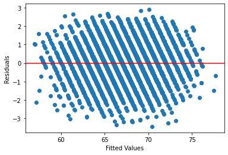

# Evaluating Student Performance Factors Using Linear Regression
This project showcases data cleaning and analysis techniques to explore factors that could affect student performance. The dataset used in this project was sourced from Kaggle and is intended for educational and portfolio purposes; therefore, findings should be interpreted as illustrative rather than definitive.

## Key Skills
* Cleaning and Preparing Data
* Linear Regression

## Project Overview
As a former English teacher and current language student, I’ve spent a lot of time developing an understanding of how people learn. Through my experience in education, I’ve observed patterns that appear to influence student performance, which I aim to examine more systematically in this project.

This project evaluates and identifies variables that are statistically significant to student performance-measured by exam scores. It demonstrates a complete analytical workflow, including data preprocessing, model fitting, evaluation, and statistical testing.

## Dataset Description
The dataset contains 20 variables describing student profiles, including:
* **Socioeconomic Factors:** School_Type, Access_to_Resources, Internet_Access, Tutoring_Sessions, Family_Income, Parental_Education_Level
* **Student Effort & Engagement:** Hours_Studied, Attendance, Motivation_Level
* **Academic Background:** Previous_Scores
* **School & Instructional Quality:** Teacher_Quality
* **Social & Environmental Influences:** Parental_Involvement, Peer_Influence
* **Lifestyle & Well-being:** Sleep_Hours, Physical_Activity, Extracurricular_Activities
* **Accessibility & Constraints:** Distance_from_Home, Learning_Disabilities
* **Demographics:** Gender
* **Target Variable:** Exam Score (integer 0-100)

## Methodology

### Data Cleaning and Preprocessing

The data cleaning process checked for and addressed the following:

1. Data Entry Errors: Checked for duplicate and impossible values (dropped 1 row with an exam score > 100%)
2. Standardization: Checked for standardization among categorical variables to ensure consistancy (e.g. variations in spelling and capitalization)
3. Null values: Identified and dropped rows with null values after performing MCAR test to evaluate any significant correlation to exam scores.

[Data cleaning process](student_performance/student_factors_cleaning.ipynb)

### Visualizing Data

Visual analysis in Tableau revealed four variables that show a visible relationship with median exam score: attendance, hours studied, tutoring sessions, and parental involvement. Among these, attendance and hours studied demonstrate the strongest variation in median scores, while parental involvement and tutoring sessions show more modest differences. 

_by_attendance.png)

*Figure 1: Chart displaying median exam score by attendance shows a positive correlation across all teaching quality levels*

_by_hours_studied.png)

*Figure 2: median exam score by hours studied*

Figure 1 and Figure 2 show a noticable correlation between factors and median exam score and a larger range in median scores signalling a potential cause and effect relationship. Based on these figures we try to fit a linear model with the focus on evaluating the significance of attendance and hours studied on a student's exam score.

#### Tableau Dashboard
[View Dashboard](https://public.tableau.com/views/studentexamscoreexploration/Dashboard1?:language=en-US&:sid=&:redirect=auth&publish=yes&showOnboarding=true&:display_count=n&:origin=viz_share_link)

### Key Factors of Interest

As expected, a scatterplot of Exam scores vs Attendance and Exam Scores vs Hours studied show a weak positive linear relationship for these variables with a large amount of noise which may be the influence of other variables.

*Figure 3: Scatterplot of Exam Score vs Attendance*

*Figure 4: Scatterplot of Exam Score vs Hours Studied*

### Checking Model Assumptions

The workflow for checking model assumptions for an LM is as follows:
* Residuals vs fitted → linearity + homoscedasticity (visual)
* QQ plot → normality
* Breusch–Pagan → formal heteroskedasticity/homoscedasticity test
* Durbin–Watson / residual ordering → independence
* VIF → multicollinearity
* Cook’s distance / leverage → influence

First I checked for linearity, homoskedasticity, and normality of residuals by plotting the residuals vs fitted values and a qq-plot of the residuals.

These both indicate issues with our model. These graphs show 2 distinct clusters as opposed to a curve or funnel like trend typically seen. Examining the observations that resulted in large residual values found that they were all from high performing students (with exam scores >=78). This suggests perhaps our model does a poor job of predicting high performing students possibly due to key variables missing. 

Specifically 54 observations from the dataset are high performing students (with exam scores >=78) with 49 out of 54 observations contributing to very large (abnormal) residual values. This does not appear to be an issue that can be fixed by adding a nonlinear or interaction term. Looking at a histogram of the exam scores also pictures high scorers as a very small proportion of the overall sample population.

As we are unable to accurately account for high performing students I decided to redefine my analysis to focus on exploring what factors influence exam scores among mid-performing students.

#### Removing High Performers and Refitting the Data

After dropping the observations of high performing students and refitting the model we get a much more reasonable qq-plot with very mild non-normality which we can ignore.

However the fitted values vs residuals plot shows diagonal banding as opposed to a random scatter. A random scatter is expected and signifies the assumption of homoskedasticity holds, but performing a Breusch-Pagan test validates there is no statistical evidence of heteroskedasticity and our model assumptions hold.

`het_breuschpagan(lm_avg.resid, lm_avg.model.exog)

output: (16.65273136551327, 0.5470899736943641, 0.9248073942751136, 0.5475789633026553)`

*both p-values are > 0.05 so there is no evidence to reject the null hypothesis (H₀): homoskedasticity (constant error variance)*

Since the fitted values vs residuals plot shows banding we can not use it to check the assumption of linearity

